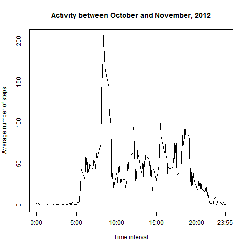
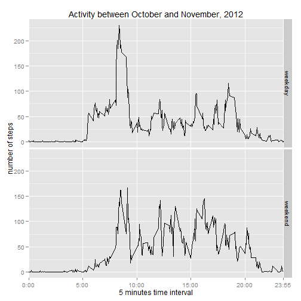

Reproducible Research: Peer Assessment 1
===========================================
### Data
The variables included in this dataset are:

  - steps: Number of steps taking in a 5-minute interval (missing values are coded as NA)

  - date: The date on which the measurement was taken in YYYY-MM-DD format

  - interval: Identifier for the 5-minute interval in which measurement was taken

The dataset is stored in a comma-separated-value (CSV) file and there are a total of 17,568 observations in this dataset.

### Loading and preprocessing the data

1. Load the unzipped data (in the data folder) into activity_data frame. The dataset is stored in a comma-separated-value (CSV) file and there are a total of 17,568 observations in this dataset.


```r
activity_data <- read.csv("./data/activity.csv", header=TRUE)
str(activity_data)
```

```
## 'data.frame':	17568 obs. of  3 variables:
##  $ steps   : int  NA NA NA NA NA NA NA NA NA NA ...
##  $ date    : Factor w/ 61 levels "2012-10-01","2012-10-02",..: 1 1 1 1 1 1 1 1 1 1 ...
##  $ interval: int  0 5 10 15 20 25 30 35 40 45 ...
```

2. Process and transform the date into a date object


```r
activity_data$date <- as.Date(as.character(activity_data$date, "%Y%m%d"))
```


### What is **mean** and **median** total number of steps taken per day?

Display the summary information about the dataset and calculate the daily step sum by using aggregate function


```r
summary(activity_data)
```

```
##      steps            date               interval   
##  Min.   :  0.0   Min.   :2012-10-01   Min.   :   0  
##  1st Qu.:  0.0   1st Qu.:2012-10-16   1st Qu.: 589  
##  Median :  0.0   Median :2012-10-31   Median :1178  
##  Mean   : 37.4   Mean   :2012-10-31   Mean   :1178  
##  3rd Qu.: 12.0   3rd Qu.:2012-11-15   3rd Qu.:1766  
##  Max.   :806.0   Max.   :2012-11-30   Max.   :2355  
##  NA's   :2304
```

```r
daily_steps_sum <- aggregate(steps ~ date, activity_data, sum, rm.na=TRUE)
str(daily_steps_sum)
```

```
## 'data.frame':	53 obs. of  2 variables:
##  $ date : Date, format: "2012-10-02" "2012-10-03" ...
##  $ steps: int  127 11353 12117 13295 15421 11016 12812 9901 10305 17383 ...
```

1. Make a histogram of the total number of steps taken each day


```r
hist(daily_steps_sum$steps, xlab = "number of steps", main = "Histogram of total number of steps taken each day", ylab = "")
```

 

2. Calculate and report the Mean and median total number of steps taken each day


```r
mean_daily_steps <- mean(daily_steps_sum$steps)
median_daily_steps <- median(daily_steps_sum$steps)
```

  - *The **mean** total number of steps taken per day is 1.0767 &times; 10<sup>4</sup> steps.*

  - *The **median** total number of steps taken per day is 10766 steps.*


### What is the average daily activity pattern?

1. Make a time series plot (i.e. type = "l") of the 5-minute interval (x-axis) and average number of steps taken, averaged across all days (y-axis)


```r
average_steps <- aggregate(steps ~ interval, activity_data, mean, rm.na = TRUE)
str(average_steps)
```

```
## 'data.frame':	288 obs. of  2 variables:
##  $ interval: int  0 5 10 15 20 25 30 35 40 45 ...
##  $ steps   : num  1.717 0.3396 0.1321 0.1509 0.0755 ...
```

```r
plot(average_steps$interval, average_steps$steps, type = "l", xaxt = "n", xlab = "Time interval",
     ylab = "Average number of steps", main = "Activity between October and November, 2012")
axis(1, labels = c('0:00', '5:00', '10:00', '15:00', '20:00', '23:55'),
     at = c(0, 500, 1000, 1500, 2000, 2355))
```

 

2. Which 5-minute interval, on average across all the days in the dataset, contains the maximum number of steps.

  - first find the line number that has the maximum number of steps, store the line number in variable t
  - then retrive the intervel from the line


```r
t <- which(average_steps$steps == max(average_steps$steps)) 
max_interval <- average_steps[t, "interval"]
```

  - *The interval begin at 835 contains the maxium number of steps (in hmm format)*


### Imputing missing values

1. Calculate and report the total number of missing values in the dataset


```r
inactivity <- sum(is.na(activity_data$steps))
activity <- sum(!is.na(activity_data$steps))
```

  - *The Total number of missing values in the dataset is 2304.*
  

2. Use the mean for the 5-minute interval to fill in all the missing value. The mean for the 5-minute interval were calculated in the previous step and is stored in the "average_steps" dataset. first display the summary of the dataset. and the call the plyr package


```r
summary(average_steps)
```

```
##     interval        steps       
##  Min.   :   0   Min.   :  0.00  
##  1st Qu.: 589   1st Qu.:  2.49  
##  Median :1178   Median : 34.11  
##  Mean   :1178   Mean   : 37.38  
##  3rd Qu.:1766   3rd Qu.: 52.83  
##  Max.   :2355   Max.   :206.17
```

3. Create a new dataset (imputed_activity) that is equal to the original dataset but with the missing value filled in.


```r
imputed_activity <- activity_data
for (i in (1: length(imputed_activity$steps))){
    if (is.na(imputed_activity$steps[i])){
        int <- imputed_activity$interval[i]
        imputed_activity$steps[i] <- average_steps[(average_steps$interval == int),2]
    }
}
```

  - display the difference between the original data and imputed data
  

```r
summary(activity_data)
```

```
##      steps            date               interval   
##  Min.   :  0.0   Min.   :2012-10-01   Min.   :   0  
##  1st Qu.:  0.0   1st Qu.:2012-10-16   1st Qu.: 589  
##  Median :  0.0   Median :2012-10-31   Median :1178  
##  Mean   : 37.4   Mean   :2012-10-31   Mean   :1178  
##  3rd Qu.: 12.0   3rd Qu.:2012-11-15   3rd Qu.:1766  
##  Max.   :806.0   Max.   :2012-11-30   Max.   :2355  
##  NA's   :2304
```

```r
summary(imputed_activity) 
```

```
##      steps            date               interval   
##  Min.   :  0.0   Min.   :2012-10-01   Min.   :   0  
##  1st Qu.:  0.0   1st Qu.:2012-10-16   1st Qu.: 589  
##  Median :  0.0   Median :2012-10-31   Median :1178  
##  Mean   : 37.4   Mean   :2012-10-31   Mean   :1178  
##  3rd Qu.: 27.0   3rd Qu.:2012-11-15   3rd Qu.:1766  
##  Max.   :806.0   Max.   :2012-11-30   Max.   :2355
```
  
  - *there are not much difference between the two dataset with imputed value. Only difference is the third qualtile of the steps variable changed from 12.0 to 27.0. And there is no NA values in the steps*
  
  
4. Make a histogram of the total number of steps taken each day and Calculate and report the Mean and median total number of steps taken each day. Do those value differ from the estimate from the non-filled data? What is the impact of the imputing missing value  on the estimates of the total daily number of steps


```r
imputed_daily_steps_sum <- aggregate(steps ~ date, imputed_activity, sum, rm.na=TRUE)
str(imputed_daily_steps_sum)
```

```
## 'data.frame':	61 obs. of  2 variables:
##  $ date : Date, format: "2012-10-01" "2012-10-02" ...
##  $ steps: num  10767 127 11353 12117 13295 ...
```

```r
hist(imputed_daily_steps_sum$steps, xlab = "number of steps", main = "Histogram of total number of steps taken each day", ylab = "")
```

 


```r
mean_imputed_daily_steps <- mean(imputed_daily_steps_sum$steps)
median_imputed_daily_steps <- median(imputed_daily_steps_sum$steps)
```


  - *The **mean** total number of steps taken per day is 1.0767 &times; 10<sup>4</sup> steps.*

  - *The **median** total number of steps taken per day is 10766 steps.*

  - *As noted before, the value did not change, except there are 61 objects in the summarized dataset instead of 53. So there are data for each day of the two months*
  
  
### Are there differences in activity patterns between weekdays and weekends?

1. create a new factor variable (week) in the dataset with two levels - "weekday" and "weekend" indicating whether a given date is weekday or weekend. 

  - first use weekdays(0 function to assign the correct date
  - then Using gsub to replace the weekdays to weekday and weekend days to weekend


```r
imputed_activity$week <- weekdays(imputed_activity$date)

imputed_activity$week <- gsub("Monday","weekday", imputed_activity$week)
imputed_activity$week <- gsub("Tuesday","weekday", imputed_activity$week)
imputed_activity$week <- gsub("Wednesday","weekday", imputed_activity$week)
imputed_activity$week <- gsub("Thursday","weekday", imputed_activity$week)
imputed_activity$week <- gsub("Friday","weekday", imputed_activity$week)
imputed_activity$week <- gsub("Saturday","weekend", imputed_activity$week)
imputed_activity$week <- gsub("Sunday","weekend", imputed_activity$week)

imputed_activity$week <- as.factor(imputed_activity$week)
str(imputed_activity)
```

```
## 'data.frame':	17568 obs. of  4 variables:
##  $ steps   : num  1.717 0.3396 0.1321 0.1509 0.0755 ...
##  $ date    : Date, format: "2012-10-01" "2012-10-01" ...
##  $ interval: int  0 5 10 15 20 25 30 35 40 45 ...
##  $ week    : Factor w/ 2 levels "weekday","weekend": 1 1 1 1 1 1 1 1 1 1 ...
```

2. Make a panel plot containing a time series plot of the 5-minute interval (x-axis) and the average number of step taken, averaged across all weekday or weekend days (y-axis). First, use aggregrate function to summarize the data then use ggplot to create the panel plot.


```r
average_by_weekday <- aggregate(steps ~ week + interval, imputed_activity, mean, rm.na = TRUE)
summary(average_by_weekday)
```

```
##       week        interval        steps       
##  weekday:288   Min.   :   0   Min.   :  0.00  
##  weekend:288   1st Qu.: 589   1st Qu.:  2.05  
##                Median :1178   Median : 28.13  
##                Mean   :1178   Mean   : 38.99  
##                3rd Qu.:1766   3rd Qu.: 61.26  
##                Max.   :2355   Max.   :230.38
```


```r
library(ggplot2)
```

```
## Warning: package 'ggplot2' was built under R version 3.1.1
```

```r
##png(filename = "./panel1.png", width = 480, height = 480)

g <- ggplot(average_by_weekday, aes(interval, steps, group = week))
g + geom_line() +
    geom_line() +
    facet_grid(week ~ .) +
    scale_x_discrete(breaks = c(0, 500, 1000, 1500, 2000, 2355),
        labels = c('0:00', '5:00', '10:00', '15:00', '20:00', '23:55')) +
    labs(title = "Activity between October and November, 2012") + 
    labs(x = "5 minutes time interval") +
    labs(y = "number of steps")
```

 

```r
##dev.off()
```


